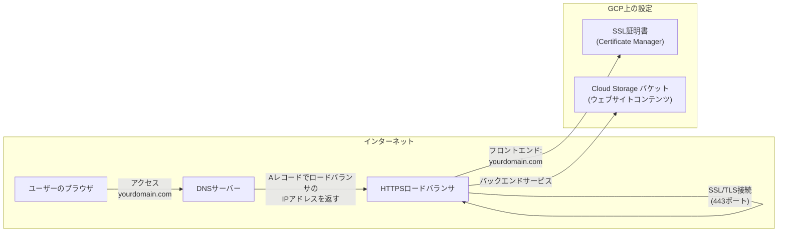

# React + TypeScript + Vite

This template provides a minimal setup to get React working in Vite with HMR and some ESLint rules.

Currently, two official plugins are available:

- [@vitejs/plugin-react](https://github.com/vitejs/vite-plugin-react/blob/main/packages/plugin-react/README.md) uses [Babel](https://babeljs.io/) for Fast Refresh
- [@vitejs/plugin-react-swc](https://github.com/vitejs/vite-plugin-react-swc) uses [SWC](https://swc.rs/) for Fast Refresh

## Expanding the ESLint configuration

If you are developing a production application, we recommend updating the configuration to enable type aware lint rules:

- Configure the top-level `parserOptions` property like this:

```js
export default tseslint.config({
  languageOptions: {
    // other options...
    parserOptions: {
      project: ['./tsconfig.node.json', './tsconfig.app.json'],
      tsconfigRootDir: import.meta.dirname,
    },
  },
})
```

- Replace `tseslint.configs.recommended` to `tseslint.configs.recommendedTypeChecked` or `tseslint.configs.strictTypeChecked`
- Optionally add `...tseslint.configs.stylisticTypeChecked`
- Install [eslint-plugin-react](https://github.com/jsx-eslint/eslint-plugin-react) and update the config:

```js
// eslint.config.js
import react from 'eslint-plugin-react'

export default tseslint.config({
  // Set the react version
  settings: { react: { version: '18.3' } },
  plugins: {
    // Add the react plugin
    react,
  },
  rules: {
    // other rules...
    // Enable its recommended rules
    ...react.configs.recommended.rules,
    ...react.configs['jsx-runtime'].rules,
  },
})
```

---
↑までは`npm create vite@latest rock-paper-scissors-react -- --template react-ts`コマンドで自動で生成されたもの

## Install Node Modules
```
npm install
```

## Run The Local Server
```
npm run dev
```

## Deploy
```
npm run build
gcloud config configurations activate YOUR_PROJECT_ID
gsutil -m rsync -r dist gs://YOUR_BUCKET_NAME
```

##（オプション）カスタムドメインの設定
静的ウェブサイトを独自のドメインで公開したい場合、以下の手順で設定します。

0.ドメインの取得
Cloud Domainsを使用して、カスタムドメインを取得する
ref: https://qiita.com/ichi_system/items/c27964b3efedb2e18371

1.ロードバランサの作成
- Cloud Load Balancing を使用して、HTTPS ロードバランサを作成します。
- バックエンドサービス：先ほど作成した Cloud Storage バケットを指定。
- フロントエンド設定：使用したいカスタムドメインとポート（通常はポート443）を指定。

2.SSL証明書の設定
- Certificate Manager を使用して、カスタムドメインのSSL証明書を取得します。
- GCPのマネージドSSL証明書を使用することで、自動的に証明書が発行されます。

3.DNSの設定
- ドメインのDNS設定で、ロードバランサのIPアドレスに向けてAレコードを設定します。

- 例：  
  | ドメイン              | レコードタイプ | 値                           |
  |--------------------|------------|------------------------------|
  | yourdomain.com.    | A          | [ロードバランサのIPアドレス]         |
  | www.yourdomain.com.| CNAME      | yourdomain.com.              |

4.確認
- SSL証明書の反映には時間がかかる場合があります（通常は最大24時間）。
- カスタムドメインにアクセスし、ウェブサイトが正しく表示されることを確認します。

ネットワーク構成図


# Cloud Build デプロイ
1. ソースリポジトリとの接続
Cloud Build がソースリポジトリにアクセスできるように、リポジトリを接続します。

GitHub リポジトリを使用する場合
注意：以下は GitHub を例に説明します。他のリポジトリサービスの場合、適宜読み替えてください。

GitHub リポジトリを接続

```
gcloud source repos create REPOSITORY_NAME
REPOSITORY_NAME を任意のリポジトリ名に置き換えてください。
GitHub リポジトリをミラーリング
```

gcloud beta builds triggers create cloud-source-repositories \
  --name=TRIGGER_NAME \
  --repo=REPOSITORY_NAME \
  --branch-pattern="BRANCH_PATTERN" \
  --build-config=cloudbuild.yaml
TRIGGER_NAME：トリガーの名前（任意）
BRANCH_PATTERN：トリガーを起動するブランチのパターン（例：^main$）
しかし、GitHub リポジトリを直接使用する場合は、以下の手順で接続します。

GitHub アカウントを Cloud Build に接続

bash
gcloud alpha builds connections create github \
  --name=CONNECTION_NAME \
  --region=REGION
CONNECTION_NAME：接続の名前（任意）
REGION：global を使用
実行後、GitHub アプリのインストール URL が表示されます。ブラウザでその URL を開き、GitHub アカウントに Cloud Build アプリをインストールします。

リポジトリのリストを更新

bash
gcloud alpha builds repositories list --connection=CONNECTION_NAME --region=REGION
注意：alpha コマンドは実験的機能であり、今後変更される可能性があります。最新のドキュメントを確認してください。

2. Cloud Build トリガーの作成
接続したリポジトリに対して、トリガーを作成します。

bash
gcloud alpha builds triggers create github \
  --name=TRIGGER_NAME \
  --repo-owner=GITHUB_USER_OR_ORG \
  --repo-name=REPO_NAME \
  --branch-pattern=BRANCH_PATTERN \
  --build-config=cloudbuild.yaml \
  --include-logs-with-status
GITHUB_USER_OR_ORG：GitHub のユーザー名または組織名
REPO_NAME：リポジトリ名
BRANCH_PATTERN：トリガーを起動するブランチの正規表現パターン（例：^main$）
例：

bash
gcloud alpha builds triggers create github \
  --name="rock-paper-scissors-deploy-trigger" \
  --repo-owner="your-github-username" \
  --repo-name="rock-paper-scissors-react" \
  --branch-pattern="^main$" \
  --build-config="cloudbuild.yaml" \
  --include-logs-with-status
オプション説明：

--include-logs-with-status：ビルドのステータスにログへのリンクを含めます。
3. サービス アカウントの権限設定
Cloud Build が必要なリソースにアクセスできるように、サービス アカウントに適切な権限を付与します。

サービス アカウントのメールアドレスを取得

bash
PROJECT_NUMBER=$(gcloud projects describe YOUR_PROJECT_ID --format='get(projectNumber)')
CLOUD_BUILD_SA="${PROJECT_NUMBER}@cloudbuild.gserviceaccount.com"
YOUR_PROJECT_ID を実際のプロジェクト ID に置き換えてください。
Cloud Storage へのアクセス権限を付与

bash
gcloud projects add-iam-policy-binding YOUR_PROJECT_ID \
  --member="serviceAccount:${CLOUD_BUILD_SA}" \
  --role="roles/storage.admin"
roles/storage.admin：Cloud Storage バケットの作成・削除・オブジェクトの管理が可能になります。
注意：必要な最小限の権限のみを付与することが推奨されます。セキュリティの観点から、適切な役割を選択してください。

4. トリガーの確認
作成したトリガーを一覧表示して確認します。

bash
gcloud beta builds triggers list
特定のトリガーの詳細を確認するには：

bash
gcloud beta builds triggers describe TRIGGER_NAME
追加情報
gcloud コマンドのヘルプ

各コマンドの詳細な使い方を確認するには、--help オプションを使用します。

bash
gcloud alpha builds triggers create github --help
他のリポジトリサービスの使用

Cloud Build は、GitLab や Bitbucket などの他のリポジトリサービスとも連携できます。適宜ドキュメントを参照してください。

自動ビルドのテスト

トリガーを作成したら、実際にコードをプッシュしてビルドが開始されるかテストしてください。

